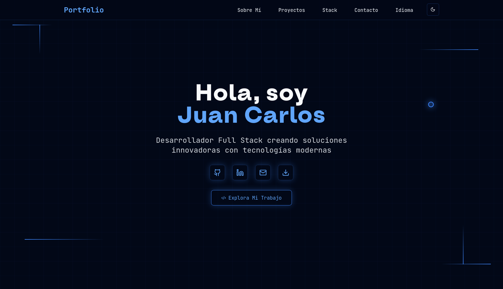

#  Personal Portfolio

  [](https://app.netlify.com/projects/juancarloslopezmoreno/deploys)


##  About the Project

Personal portfolio developed with a minimalist and modern approach, designed to showcase my skills as a Full Stack Developer. It features an interactive custom cursor inspired by Framer and offers a fully responsive user experience.

###  Key Features

-  **Minimalist Design** – Clean interface with a dark theme and blue accents

##  Tech Stack

### Frontend


### UI/UX


### Development Tools 


### Deployment


---

##  Live Demo

**[View Portfolio](https://juancarloslopezmoreno.netlify.app/)**

---

##  Project Structure

```
my-porfolio.dots/
├── 📁 public/                       # Static assets
│   ├── 📁 projects/                 # Project Images
│   └── 📄 CV-Juan.pdf               # Curriculum Vitae
├── 📁 src/
│   ├── 📁 components/               # React Components
│   │   ├── 🎨 CustomCursor.tsx      # Custom Cursor
│   │   ├── 🏠 Hero.tsx              # Hero Section
│   │   ├── 👤 AboutMe.tsx           # About me Section
│   │   ├── 🚀 Projects.tsx          # Projects Section 
│   │   └── 🛠️ Stack.tsx             # Tech Stack Section
│   ├── 📁 hooks/                    # Custom hooks
│   │   └── 🖱️ useCursor.ts          # Cursor Logic
│   ├── 📁 locales/                  # Translation Files
│   │   ├── 🇪🇸 es.json                # Spanish
│   │   └── 🇺🇸 en.json                # English
│   └── 📁 pages/                    # Main pages
├── 📄 tailwind.config.ts            # Tailwind configuration
├── 📄 vite.config.ts                # Vite configuration
└── 📄 package.json                  # Project depnedencies

```

##  Contact

**Juan Carlos López Moreno**

[](https://www.linkedin.com/in/juan-carlos-lopez-moreno-9a29b0299/)
[](https://github.com/juanchopi37)
[](juancarloslopezmoreno@proton.me)


---

<div align="center">
  <p>⭐ If you like it, give it a star</p>
</div>


